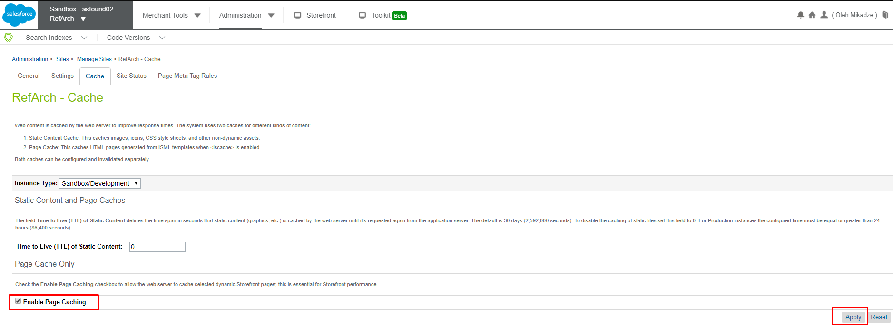

## Lab-11: Using Page Level Caching

This walkthrough is about Page Level Caching, here you need to turn on general Caching for RefArch in BM, create a test template with iscache tag and verify if it will work properly on the storefront.

1. Enable page caching for the *RefArch* site in *Business Manager*:
   1. Administration ⇒ Sites ⇒ Manage Sites ⇒ SiteGenesis ⇒ Cache (tab). 
   2. Check Enable page caching checkbox. Click Apply.
    
2. Create a new *Caching* controller.
   ```javascript
    'use strict';

    var server = require('server');

    server.get('Main', function (req, res, next) {
        res.render('caching/cacheTemp');
        next();
    });

    module.exports = server.exports();
   ```
3. Create a new *cachedpage.isml* template in the new folder that displays the current time:
   1. Study the  [TopLevel.Date](https://documentation.b2c.commercecloud.salesforce.com/DOC1/index.jsp?topic=%2Fcom.demandware.dochelp%2FDWAPI%2Fscriptapi%2Fhtml%2Fapi%2Fclass_TopLevel_Date.html)  class from the script API.
   2. Use the  *isprint*  tag to display the current date with *style=”DATE_TIME”* so only the time shows:

    ```javascript
    <isprint value="${Date()}" style="DATE_TIME">
    ```
4. View page without caching it: invoke the Caching-<function_name> controller multiple times, check if the time changes.
5. Cache the page and view it:
   1. Add  *iscache*  tag with a relative time of 24 hours. 
   ```javascript
   <iscache type="relative" hour="24" />
   ```
   1. Call Caching-Start multiple times: Result: the time does not change.
6. Commit and Push to new branch, create Pull Request


[**back to labs**](../README.md) | [next](../lab-12/readme.md)
